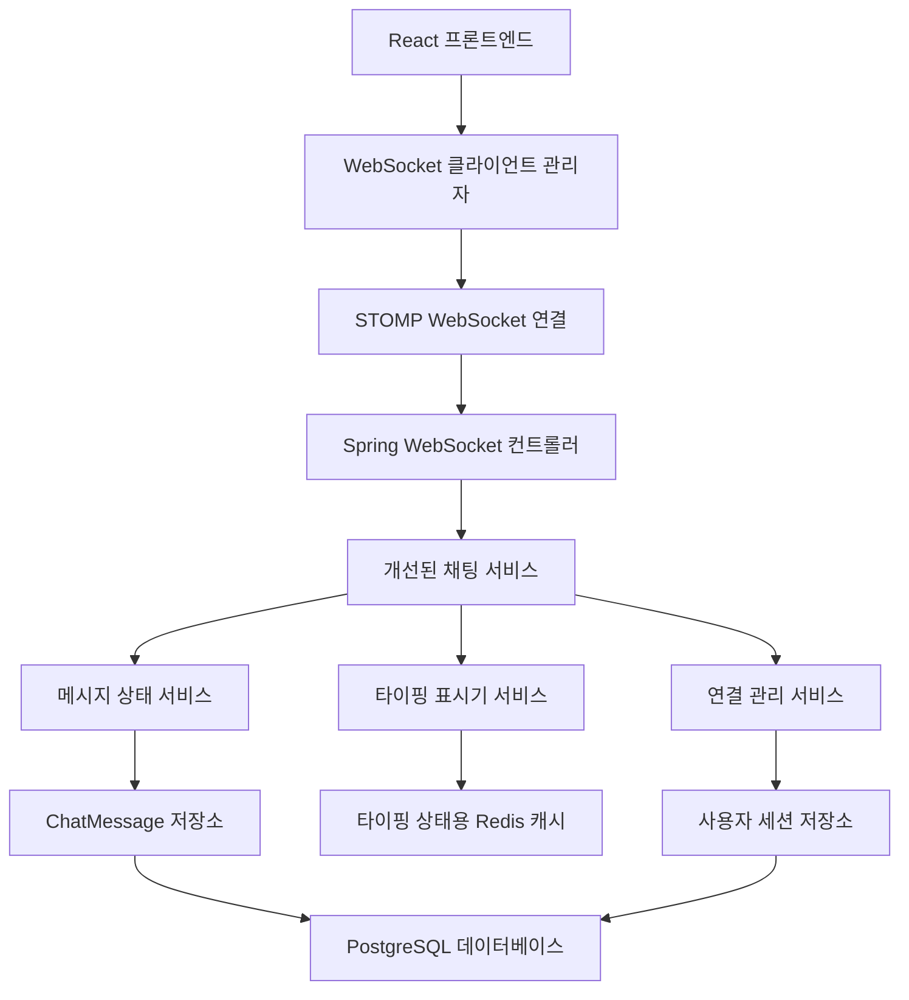

# 채팅 기능 개선 설계 문서

## 개요

이 설계 문서는 HobbyLink의 기존 실시간 채팅 시스템 개선 사항을 설명합니다. 현재 시스템은 WebSocket 연결을 통해 기본적인 메시징 기능을 제공하지만, 타이핑 표시기, 메시지 상태 추적, 강력한 오류 처리와 같은 고급 기능이 부족합니다. 이번 개선은 기존 Spring Boot WebSocket 구현을 기반으로 더 포괄적인 채팅 경험을 제공할 것입니다.

## 아키텍처

### 현재 아키텍처 분석
- **백엔드**: Spring Boot와 WebSocket (STOMP 프로토콜)
- **데이터베이스**: ChatMessage 영속성을 위한 JPA 엔티티
- **프론트엔드**: React (package.json 기반 추정)
- **메시지 흐름**: 실시간 업데이트를 위한 REST API + WebSocket

### 개선된 아키텍처 구성 요소



## 구성 요소 및 인터페이스

### 1. 개선된 백엔드 구성 요소

#### 1.1 메시지 상태 추적
```java
// 메시지 상태를 위한 새로운 열거형
public enum MessageStatus {
    SENDING, DELIVERED, READ, FAILED
}

// 개선된 ChatMessage 엔티티
@Entity
public class ChatMessage {
    // ... 기존 필드
    @Enumerated(EnumType.STRING)
    private MessageStatus status = MessageStatus.SENDING;
    
    private LocalDateTime deliveredAt;
    private LocalDateTime readAt;
    private String clientMessageId; // 클라이언트 측 추적용
}
```

#### 1.2 타이핑 표시기 시스템
```java
// 타이핑 상태를 위한 새로운 엔티티
@Entity
public class TypingStatus {
    @Id
    private String id; // meetupId + userId
    private Long meetupId;
    private Long userId;
    private LocalDateTime lastTypingAt;
    private boolean isTyping;
}

// 타이핑 표시기 관리를 위한 서비스
@Service
public class TypingIndicatorService {
    public void startTyping(Long meetupId, Long userId);
    public void stopTyping(Long meetupId, Long userId);
    public List<User> getTypingUsers(Long meetupId);
}
```

#### 1.3 연결 관리
```java
// 사용자 연결 관리를 위한 서비스
@Service
public class ConnectionManagerService {
    private final Map<String, UserSession> activeSessions = new ConcurrentHashMap<>();
    
    public void addUserSession(String sessionId, Long userId, Long meetupId);
    public void removeUserSession(String sessionId);
    public List<User> getOnlineUsers(Long meetupId);
    public void updateUserActivity(String sessionId);
}

// 사용자 세션 추적
public class UserSession {
    private String sessionId;
    private Long userId;
    private Long meetupId;
    private LocalDateTime lastActivity;
    private UserStatus status; // ONLINE, AWAY, OFFLINE
}
```

#### 1.4 개선된 WebSocket 컨트롤러
```java
@Controller
public class EnhancedWebSocketChatController {
    
    @MessageMapping("/chat/{meetupId}/message")
    @SendTo("/topic/meetup/{meetupId}/messages")
    public ChatMessageResponse sendMessage(@DestinationVariable Long meetupId, ChatMessageRequest request);
    
    @MessageMapping("/chat/{meetupId}/typing")
    @SendTo("/topic/meetup/{meetupId}/typing")
    public TypingIndicatorResponse handleTyping(@DestinationVariable Long meetupId, TypingRequest request);
    
    @MessageMapping("/chat/{meetupId}/status")
    @SendTo("/topic/meetup/{meetupId}/status")
    public MessageStatusResponse updateMessageStatus(@DestinationVariable Long meetupId, MessageStatusRequest request);
}
```

### 2. 프론트엔드 구성 요소

#### 2.1 WebSocket 연결 관리자
```javascript
class WebSocketManager {
    constructor(meetupId, userId) {
        this.meetupId = meetupId;
        this.userId = userId;
        this.stompClient = null;
        this.reconnectAttempts = 0;
        this.maxReconnectAttempts = 5;
        this.reconnectDelay = 1000;
        this.messageQueue = [];
        this.connected = false;
    }
    
    connect() {
        const socket = new SockJS('/ws');
        this.stompClient = Stomp.over(socket);
        
        this.stompClient.connect(
            {
                userId: this.userId,
                meetupId: this.meetupId
            },
            this.onConnected.bind(this),
            this.onError.bind(this)
        );
    }
    
    onConnected() {
        this.connected = true;
        this.reconnectAttempts = 0;
        
        // 메시지 구독
        this.stompClient.subscribe(
            `/topic/meetup/${this.meetupId}/messages`,
            this.onMessageReceived.bind(this)
        );
        
        // 타이핑 상태 구독
        this.stompClient.subscribe(
            `/topic/meetup/${this.meetupId}/typing`,
            this.onTypingStatusReceived.bind(this)
        );
        
        // 메시지 상태 업데이트 구독
        this.stompClient.subscribe(
            `/topic/meetup/${this.meetupId}/status`,
            this.onMessageStatusReceived.bind(this)
        );
        
        // 큐에 있는 메시지 전송
        this.flushMessageQueue();
    }
    
    disconnect() {
        if (this.stompClient) {
            this.stompClient.disconnect();
            this.connected = false;
        }
    }
    
    sendMessage(content, clientMessageId) {
        const message = {
            content: content,
            senderId: this.userId,
            meetupId: this.meetupId,
            clientMessageId: clientMessageId || uuidv4(),
            timestamp: new Date()
        };
        
        if (this.connected) {
            this.stompClient.send(
                `/app/chat/${this.meetupId}/message`,
                {},
                JSON.stringify(message)
            );
        } else {
            // 연결이 끊어진 경우 메시지 큐에 추가
            this.messageQueue.push({
                destination: `/app/chat/${this.meetupId}/message`,
                message: message
            });
            
            // 재연결 시도
            this.reconnect();
        }
        
        return message.clientMessageId;
    }
    
    sendTypingIndicator(isTyping) {
        if (this.connected) {
            this.stompClient.send(
                `/app/chat/${this.meetupId}/typing`,
                {},
                JSON.stringify({
                    userId: this.userId,
                    meetupId: this.meetupId,
                    isTyping: isTyping
                })
            );
        }
    }
    
    markMessageAsRead(messageId) {
        if (this.connected) {
            this.stompClient.send(
                `/app/chat/${this.meetupId}/status`,
                {},
                JSON.stringify({
                    messageId: messageId,
                    userId: this.userId,
                    status: 'READ'
                })
            );
        }
    }
    
    onError() {
        this.connected = false;
        this.reconnect();
    }
    
    reconnect() {
        if (this.reconnectAttempts >= this.maxReconnectAttempts) {
            return;
        }
        
        setTimeout(() => {
            this.reconnectAttempts++;
            this.reconnectDelay *= 2; // 지수 백오프
            this.connect();
        }, this.reconnectDelay);
    }
    
    flushMessageQueue() {
        if (this.connected && this.messageQueue.length > 0) {
            this.messageQueue.forEach(item => {
                this.stompClient.send(
                    item.destination,
                    {},
                    JSON.stringify(item.message)
                );
            });
            this.messageQueue = [];
        }
    }
}
```

#### 2.2 개선된 채팅 컴포넌트
```javascript
const EnhancedChat = ({ meetupId, currentUser }) => {
    const [messages, setMessages] = useState([]);
    const [typingUsers, setTypingUsers] = useState([]);
    const [onlineUsers, setOnlineUsers] = useState([]);
    const [connectionStatus, setConnectionStatus] = useState('connecting');
    const [inputMessage, setInputMessage] = useState('');
    const [isTyping, setIsTyping] = useState(false);
    const typingTimeoutRef = useRef(null);
    const wsManager = useRef(null);
    const messagesEndRef = useRef(null);
    
    useEffect(() => {
        // WebSocket 연결 관리자 초기화
        wsManager.current = new WebSocketManager(meetupId, currentUser.id);
        wsManager.current.connect();
        
        // 이전 메시지 로드
        loadPreviousMessages();
        
        // 컴포넌트 언마운트 시 연결 해제
        return () => {
            if (wsManager.current) {
                wsManager.current.disconnect();
            }
            if (typingTimeoutRef.current) {
                clearTimeout(typingTimeoutRef.current);
            }
        };
    }, [meetupId, currentUser.id]);
    
    // 메시지 목록 스크롤 처리
    useEffect(() => {
        scrollToBottom();
    }, [messages]);
    
    const loadPreviousMessages = async () => {
        try {
            const response = await axios.get(`/api/meetups/${meetupId}/messages`);
            setMessages(response.data);
            
            // 읽지 않은 메시지를 읽음으로 표시
            response.data.forEach(msg => {
                if (msg.senderId !== currentUser.id && msg.status !== 'READ') {
                    wsManager.current.markMessageAsRead(msg.id);
                }
            });
        } catch (error) {
            console.error('메시지 로드 실패:', error);
        }
    };
    
    const handleSendMessage = () => {
        if (!inputMessage.trim()) return;
        
        const clientMessageId = wsManager.current.sendMessage(inputMessage.trim());
        
        // 낙관적 UI 업데이트
        setMessages(prev => [...prev, {
            id: null,
            content: inputMessage.trim(),
            senderId: currentUser.id,
            senderName: currentUser.username,
            status: 'SENDING',
            clientMessageId,
            timestamp: new Date()
        }]);
        
        setInputMessage('');
        setIsTyping(false);
        wsManager.current.sendTypingIndicator(false);
    };
    
    const handleInputChange = (e) => {
        setInputMessage(e.target.value);
        
        // 타이핑 표시기 처리
        if (!isTyping) {
            setIsTyping(true);
            wsManager.current.sendTypingIndicator(true);
        }
        
        // 타이핑 중지 타이머 재설정
        if (typingTimeoutRef.current) {
            clearTimeout(typingTimeoutRef.current);
        }
        
        typingTimeoutRef.current = setTimeout(() => {
            setIsTyping(false);
            wsManager.current.sendTypingIndicator(false);
        }, 2000);
    };
    
    const scrollToBottom = () => {
        messagesEndRef.current?.scrollIntoView({ behavior: 'smooth' });
    };
    
    return (
        <div className="enhanced-chat">
            <div className="chat-header">
                <h3>채팅</h3>
                <div className="online-users">
                    {onlineUsers.length > 0 && (
                        <span>{onlineUsers.length} 명 접속 중</span>
                    )}
                </div>
                <div className="connection-status">
                    {connectionStatus === 'connected' ? (
                        <span className="status-connected">연결됨</span>
                    ) : connectionStatus === 'connecting' ? (
                        <span className="status-connecting">연결 중...</span>
                    ) : (
                        <span className="status-disconnected">연결 끊김</span>
                    )}
                </div>
            </div>
            
            <div className="chat-messages">
                {messages.map(msg => (
                    <div 
                        key={msg.clientMessageId || msg.id} 
                        className={`message ${msg.senderId === currentUser.id ? 'own-message' : 'other-message'}`}
                    >
                        {msg.senderId !== currentUser.id && (
                            <div className="message-sender">{msg.senderName}</div>
                        )}
                        <div className="message-content">{msg.content}</div>
                        <div className="message-meta">
                            <span className="message-time">
                                {new Date(msg.timestamp).toLocaleTimeString([], { hour: '2-digit', minute: '2-digit' })}
                            </span>
                            {msg.senderId === currentUser.id && (
                                <span className="message-status">
                                    {msg.status === 'SENDING' && <span>전송 중...</span>}
                                    {msg.status === 'DELIVERED' && <span>전송됨</span>}
                                    {msg.status === 'READ' && <span>읽음</span>}
                                    {msg.status === 'FAILED' && <span>전송 실패</span>}
                                </span>
                            )}
                        </div>
                    </div>
                ))}
                <div ref={messagesEndRef} />
                
                {typingUsers.length > 0 && (
                    <div className="typing-indicator">
                        {typingUsers.length === 1 ? (
                            <span>{typingUsers[0].username}님이 입력 중...</span>
                        ) : (
                            <span>{typingUsers.length}명이 입력 중...</span>
                        )}
                    </div>
                )}
            </div>
            
            <div className="chat-input">
                <textarea
                    value={inputMessage}
                    onChange={handleInputChange}
                    onKeyPress={(e) => e.key === 'Enter' && !e.shiftKey && handleSendMessage()}
                    placeholder="메시지를 입력하세요..."
                />
                <button onClick={handleSendMessage} disabled={!inputMessage.trim()}>
                    전송
                </button>
            </div>
        </div>
    );
};
```

## 데이터 모델

### 개선된 ChatMessage 모델
```sql
CREATE TABLE chat_messages (
    id BIGSERIAL PRIMARY KEY,
    content TEXT NOT NULL,
    type VARCHAR(20) DEFAULT 'TEXT',
    status VARCHAR(20) DEFAULT 'SENDING',
    media_url VARCHAR(500),
    client_message_id VARCHAR(100),
    sent_at TIMESTAMP DEFAULT CURRENT_TIMESTAMP,
    delivered_at TIMESTAMP,
    read_at TIMESTAMP,
    meetup_id BIGINT REFERENCES meetups(id),
    sender_id BIGINT REFERENCES users(id),
    INDEX idx_meetup_sent_at (meetup_id, sent_at),
    INDEX idx_client_message_id (client_message_id)
);
```

### 타이핑 상태 모델
```sql
CREATE TABLE typing_status (
    id VARCHAR(100) PRIMARY KEY, -- meetupId_userId
    meetup_id BIGINT NOT NULL,
    user_id BIGINT NOT NULL,
    is_typing BOOLEAN DEFAULT FALSE,
    last_typing_at TIMESTAMP DEFAULT CURRENT_TIMESTAMP,
    FOREIGN KEY (meetup_id) REFERENCES meetups(id),
    FOREIGN KEY (user_id) REFERENCES users(id),
    INDEX idx_meetup_typing (meetup_id, is_typing)
);
```

### 사용자 세션 모델
```sql
CREATE TABLE user_sessions (
    session_id VARCHAR(100) PRIMARY KEY,
    user_id BIGINT NOT NULL,
    meetup_id BIGINT NOT NULL,
    status VARCHAR(20) DEFAULT 'ONLINE',
    last_activity TIMESTAMP DEFAULT CURRENT_TIMESTAMP,
    connected_at TIMESTAMP DEFAULT CURRENT_TIMESTAMP,
    FOREIGN KEY (user_id) REFERENCES users(id),
    FOREIGN KEY (meetup_id) REFERENCES meetups(id),
    INDEX idx_meetup_online (meetup_id, status)
);
```

## 오류 처리

### 1. 연결 오류 처리
- **자동 재연결**: WebSocket 재연결을 위한 지수 백오프 구현
- **메시지 큐잉**: 연결이 끊어졌을 때 메시지를 로컬에 큐잉
- **재연결 시 동기화**: 연결이 복원되면 놓친 메시지 가져오기

### 2. 메시지 전달 보장
- **클라이언트 측 메시지 ID**: 메시지 추적을 위한 고유 ID 생성
- **재시도 메커니즘**: 지수 백오프를 통한 실패한 메시지 재시도
- **중복 방지**: 클라이언트 메시지 ID를 사용하여 중복 방지

### 3. 오류 응답 처리
```java
@ControllerAdvice
public class ChatErrorHandler {
    
    @MessageExceptionHandler
    public void handleMessageException(MessageHandlingException ex) {
        // 특정 사용자에게 오류 응답 전송
        messagingTemplate.convertAndSendToUser(
            ex.getUser().getUsername(),
            "/queue/errors",
            new ErrorResponse(ex.getMessage())
        );
    }
}
```

## 테스트 전략

### 1. 단위 테스트
- **서비스 계층**: 채팅 서비스 메서드, 타이핑 표시기 로직, 연결 관리 테스트
- **저장소 계층**: 메시지 페이지네이션 및 상태 업데이트를 위한 사용자 정의 쿼리 테스트
- **WebSocket 컨트롤러**: 메시지 처리 및 브로드캐스팅 테스트
- **유틸리티 함수**: 메시지 형식 변환, 유효성 검사 함수 테스트

### 2. 통합 테스트
- **WebSocket 통합**: 전체 WebSocket 메시지 흐름 테스트
- **데이터베이스 통합**: 메시지 지속성 및 검색 테스트
- **오류 시나리오**: 연결 실패 및 복구 테스트
- **보안 통합**: 인증 및 권한 부여 메커니즘 테스트

### 3. 엔드투엔드 테스트
- **다중 사용자 채팅**: 여러 사용자 간의 실시간 메시징 테스트
- **타이핑 표시기**: 타이핑 표시기 표시 및 정리 테스트
- **연결 복구**: 자동 재연결 및 메시지 동기화 테스트
- **모바일 호환성**: 다양한 모바일 기기 및 화면 크기에서의 UI 테스트
- **브라우저 호환성**: 주요 브라우저(Chrome, Firefox, Safari, Edge)에서의 기능 테스트

### 4. 성능 테스트
- **메시지 처리량**: 대량의 메시지로 시스템 성능 테스트 (초당 최대 메시지 처리량)
- **동시 사용자**: 많은 동시 사용자와 함께 시스템 동작 테스트 (최대 1,000명 동시 접속)
- **메모리 사용량**: 타이핑 상태 및 세션 관리를 위한 메모리 사용량 모니터링
- **지연 시간**: 메시지 전송 및 수신 지연 시간 측정 (목표: 평균 100ms 이하)
- **확장성 테스트**: 부하 증가에 따른 시스템 성능 변화 측정

### 5. 보안 테스트
- **취약점 스캔**: 일반적인 웹 취약점에 대한 자동화된 스캔
- **침투 테스트**: 인증 우회, XSS, CSRF 등의 공격 시나리오 테스트
- **데이터 유출 테스트**: 권한이 없는 사용자의 데이터 접근 시도 테스트
- **속도 제한 테스트**: 속도 제한 메커니즘의 효과 검증

## 구현 단계

### 1단계: 핵심 인프라 (1-2주)
- 개선된 메시지 상태 추적 시스템 구현
- 개선된 WebSocket 연결 관리 및 자동 재연결 메커니즘
- 기본 오류 처리 및 로깅 시스템
- 데이터베이스 스키마 업데이트

### 2단계: 사용자 경험 기능 (2-3주)
- 타이핑 표시기 구현
- 온라인 사용자 상태 표시
- 다양한 메시지 형식 지원 (텍스트, 이미지, 파일)
- 모바일 반응형 UI 개선

### 3단계: 고급 기능 (2-3주)
- 메시지 기록 페이지네이션 및 무한 스크롤
- 브라우저 알림 및 푸시 알림
- 메시지 전달 확인 및 읽음 표시
- 메시지 검색 기능

### 4단계: 성능 및 안정성 (1-2주)
- 연결 풀링 최적화
- 오프라인 사용자를 위한 메시지 큐잉
- 포괄적인 오류 복구 메커니즘
- 성능 모니터링 및 최적화

## 보안 고려 사항

### 1. 인증 및 권한 부여
- JWT 기반 인증을 통한 WebSocket 연결 보안
- 채팅 액세스를 허용하기 전에 사용자의 미팅 참여 확인
- 메시지 발신자 신원 확인 및 검증
- 메시지 전송에 대한 속도 제한 구현 (초당 최대 메시지 수 제한)
- 세션 타임아웃 및 자동 로그아웃 메커니즘

### 2. 입력 유효성 검사
- XSS 방지를 위한 메시지 내용 정화 (HTML 태그 및 스크립트 제거)
- 메시지 길이 및 형식 검증 (최대 길이 제한)
- 메시지 형식에서 악의적인 URL 필터링
- 파일 업로드 검증 (허용된 파일 형식, 크기 제한, 바이러스 스캔)
- SQL 인젝션 방지를 위한 파라미터화된 쿼리 사용

### 3. 개인 정보 보호
- 사용자가 참여하는 미팅의 메시지만 액세스할 수 있도록 보장
- 적절한 권한 부여로 메시지 삭제 및 수정 구현
- 보안 모니터링을 위한 액세스 패턴 로깅
- 메시지 암호화 (전송 중 및 저장 시)
- GDPR 및 개인정보 보호법 준수를 위한 데이터 보존 정책 구현

### 4. 인프라 보안
- WebSocket 연결에 TLS/SSL 적용
- 정기적인 보안 취약점 스캔 및 업데이트
- 서버 측 속도 제한 및 DDoS 방어
- 로그 관리 및 보안 이벤트 모니터링

## 모바일 지원 전략

### 1. 반응형 디자인
- 모든 화면 크기에 맞는 유동적인 레이아웃 구현
- 모바일 우선 접근 방식으로 UI 컴포넌트 설계
- 터치 친화적인 인터페이스 요소 (버튼 크기, 간격 등)

### 2. 모바일 최적화
- 이미지 및 미디어 최적화로 데이터 사용량 감소
- 오프라인 모드 지원 및 메시지 큐잉
- 배터리 사용량 최적화 (불필요한 연결 및 업데이트 최소화)

### 3. 푸시 알림
- Firebase Cloud Messaging을 통한 모바일 푸시 알림
- 백그라운드 상태에서의 새 메시지 알림
- 알림 설정 및 관리 기능

### 4. 네이티브 앱 기능 통합
- 카메라 및 갤러리 접근을 통한 이미지 공유
- 위치 공유 기능
- 오디오 메시지 녹음 및 공유

## 성능 최적화 전략

### 1. 프론트엔드 최적화
- 메시지 가상화 (Virtual List)로 대량의 메시지 렌더링 성능 향상
- 코드 분할 및 지연 로딩으로 초기 로드 시간 단축
- 메모이제이션을 통한 불필요한 렌더링 방지

### 2. 백엔드 최적화
- 메시지 페이지네이션 및 인덱싱 최적화
- Redis 캐싱을 통한 자주 접근하는 데이터 성능 향상
- 데이터베이스 쿼리 최적화 및 실행 계획 분석

### 3. 네트워크 최적화
- WebSocket 메시지 압축
- 메시지 배치 처리로 네트워크 요청 최소화
- CDN을 통한 정적 자원 제공

### 4. 모니터링 및 분석
- 실시간 성능 모니터링 구현 (Prometheus, Grafana)
- 사용자 행동 분석을 통한 최적화 포인트 식별
- 자동화된 성능 테스트 및 회귀 테스트

## 배포 및 운영 계획

### 1. 단계적 배포
- 내부 테스트 그룹에 초기 배포
- 베타 테스터 그룹에 제한적 배포
- 점진적인 전체 사용자 롤아웃

### 2. 모니터링 및 알림
- 실시간 오류 모니터링 및 알림 설정
- 사용자 피드백 수집 및 분석
- 성능 지표 대시보드 구축

### 3. 롤백 계획
- 문제 발생 시 신속한 롤백 메커니즘
- 데이터 무결성 보장을 위한 백업 전략
- 장애 복구 절차 문서화

### 4. 지속적인 개선
- 사용자 피드백 기반 기능 개선
- A/B 테스트를 통한 UI/UX 최적화
- 정기적인 성능 및 보안 검토